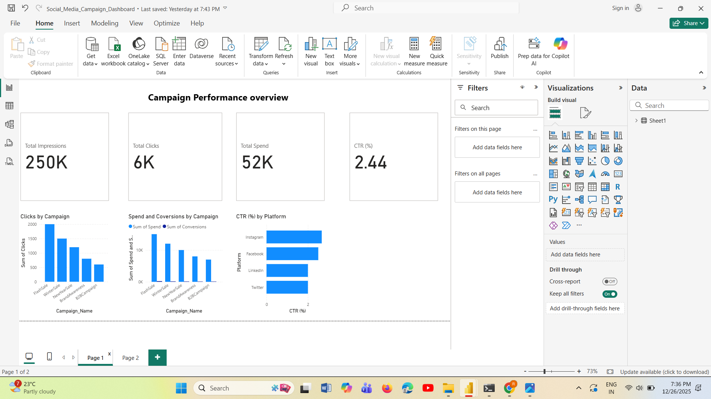
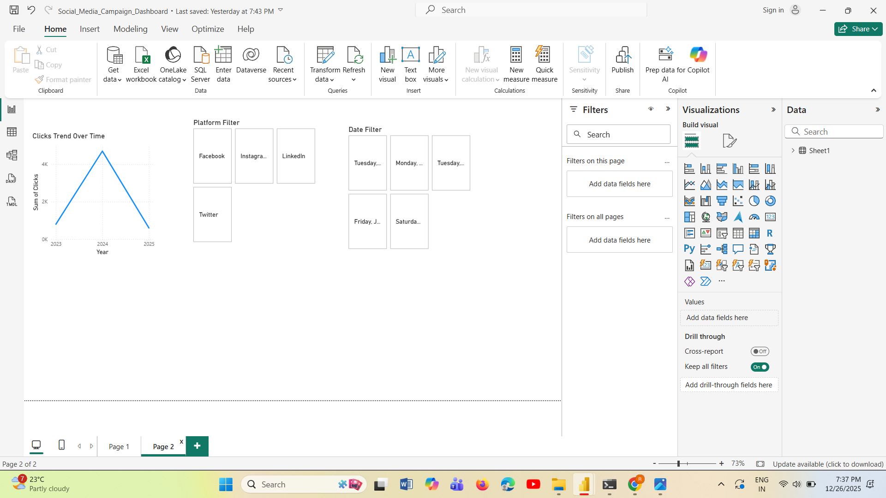
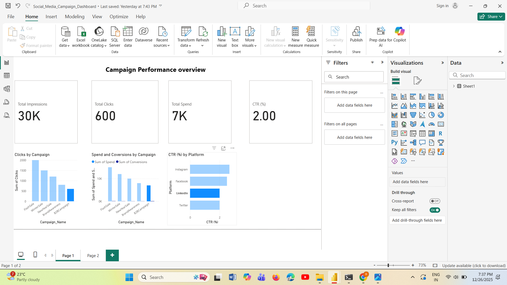
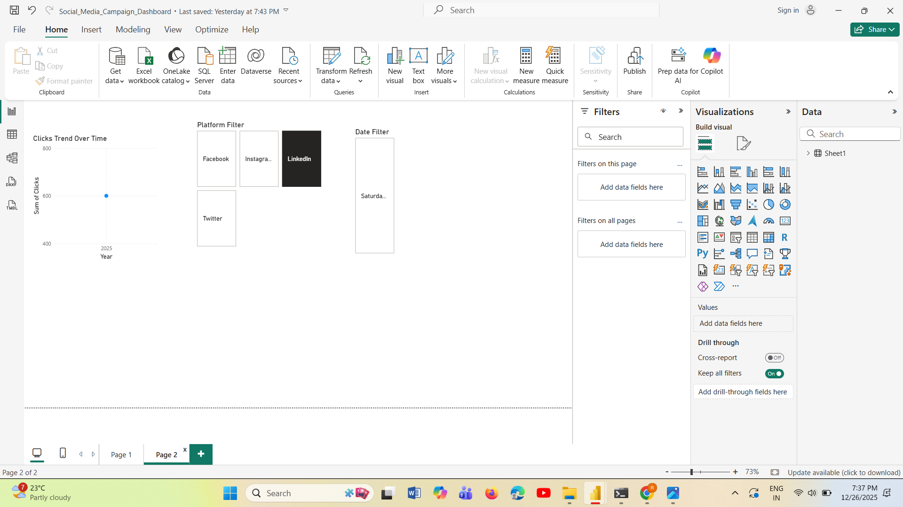

# FUTURE_DS_02
Social Media Campaign Performance Analysis using Power BI
# FUTURE_DS_02 – Social Media Campaign Performance Analysis (Power BI)

## Project Overview
This project analyzes social media campaign performance using Power BI to help evaluate marketing effectiveness and optimize decision-making.

## Key Metrics
- Total Impressions
- Total Clicks
- Total Spend
- Click Through Rate (CTR)

## Dashboard Features
- KPI cards for high-level performance tracking
- Campaign-wise and platform-wise analysis
- CTR comparison across platforms
- Interactive slicers for Platform and Date filtering

## Tools Used
- Power BI Desktop
- Microsoft Excel

## Outcome
The dashboard provides clear insights into campaign performance, enabling stakeholders to identify high-performing platforms and optimize ad spend.

